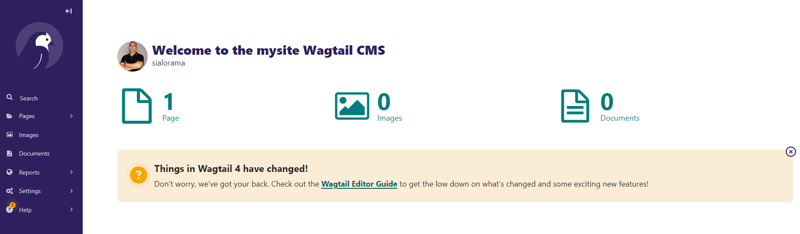

# Create your site or blog using Wagtail

Wagtail is an open source CMS written in Python and built on the Django web framework.


## Quick install:  
Run the following commands in a virtual environment of your choice:

```
pip install wagtail
```

Once installed, Wagtail provides a command similar to Django’s django-admin startproject to generate a new site/project:

```
wagtail start mysite
```

This will create a new folder mysite, based on a template containing everything you need to get started. 
More information on that template is available in the project template reference.

Inside  mysite folder, run the setup steps necessary for any Django project:

```
pip install -r requirements.txt
python manage.py migrate
python manage.py createsuperuser
python manage.py runserver
```

## Visualise your site:  
Your site is now accessible at http://localhost:8000.

With the admin backend available at http://localhost:8000/admin/, you can start modifing the blog, creating pages, importing files and images...  

  

This will set you up with a new stand-alone Wagtail project. If you’d like to add Wagtail to an existing Django project instead, see Integrating Wagtail into a Django project.
